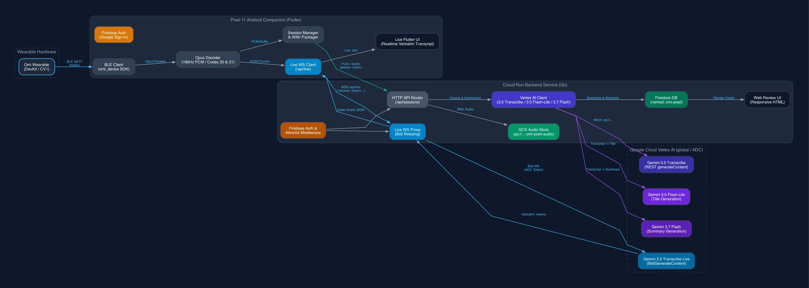

# Omi-Pixel

A standalone companion app for Google Pixel 11 and Go backend service for Omi wearable hardware, combining real-time streaming speech recognition via Gemini 3.5 Transcribe Live with post-session speaker diarization and Firestore storage.



---

## Quick Start (Makefile)

Use the top-level Makefile for common workflows:

```bash
# 1. Authorize your Google account email in Firestore
make authorize EMAIL=you@gmail.com ADMIN=true

# 2. Run Go backend locally (Firebase Auth + Vertex AI ADC)
make run-local

# 3. In a new terminal, reverse-forward port 8080 to your connected Pixel
make adb-reverse

# 4. Run the Flutter companion app on your Pixel
make run-app
```

---

## Installation & Deployment

### 1. Backend Service (Cloud Run or Local)

- **Run locally with auth active**:
  ```bash
  make run-local
  ```
- **Run locally in offline bypass mode**:
  ```bash
  make run-local-noauth
  ```
- **Deploy to Google Cloud Run**:
  ```bash
  make release
  ```

### 2. Mobile Companion App (Google Pixel 11)

Install dependencies and run the app on your connected Pixel 11:

```bash
cd omi-pixel/app
flutter pub get
flutter run
```

To install a standalone release build on your phone:
```bash
flutter build apk --release
adb install -r build/app/outputs/flutter-apk/app-release.apk
```

---

## Usage

1. **Configure Service URL**: Open the **Settings** screen in the app. Enter your Cloud Run backend URL (or `http://10.0.2.2:8080` / `http://localhost:8080` via adb reverse). Tap **Test Connection** and save.
2. **Connect Wearable**: Turn on your Omi device. Tap **Scan for Omi Device** on the home screen and select your device from the list.
3. **Record and Stream**: Tap **Start Conversation**. Your speech streams via the Cloud Run proxy to Gemini 3.5 Transcribe Live (`gemini-3.5-transcribe-live-preview`), rendering instant verbatim real-time text on your screen.
4. **Diarize and Review**: Tap **Finish Recording & Diarize**. The app packages the full session audio and uploads it to the Go backend. Gemini 3.5 Transcribe processes the audio on Vertex AI with native speaker diarization (Speaker 1, Speaker 2) and saves the conversation in Firestore.
5. **Inspect on the Web**: Open your Cloud Run URL or `http://localhost:8080` in any browser to review transcripts, summaries, and speaker turns.

---

## Documentation

- [User Guide](docs/user-guide.md): Complete setup instructions, Pixel 11 debugging guide, Android permissions matrix, and troubleshooting tips.
- [Developer Guide](docs/developer-guide.md): Technical architecture, two-pass pipeline specifications, BLE audio framing contracts, and Go REST API reference.

---

## Development

Run tests and static analysis from the respective component directories:

```bash
# Test the Go backend service
cd omi-pixel/service
go test -v ./...
go build -o /dev/null .

# Analyze and test the Flutter mobile app
cd ../app
flutter analyze
flutter test
```

### Directory Structure

```
omi-pixel/
├── app/                        # Standalone Flutter mobile companion
│   ├── lib/                    # BLE service, audio decoder, Gemini Live client, UI
│   ├── android/                # Android manifest, permissions, foreground worker
│   └── test/                   # Model serialization, WAV packager, and widget tests
├── service/                    # Go Cloud Run backend service
│   ├── main.go                 # HTTP server with graceful shutdown
│   ├── gemini.go               # Gemini 3.5 Transcribe structured diarization client
│   ├── store.go                # Firestore adapter with in-memory fallback
│   ├── handlers.go             # Audio upload, session CRUD, and web routing
│   └── web/                    # Server-rendered HTML review dashboard
├── infra/                      # Cloud automation
│   ├── setup.sh                # Enables Cloud Run, Firestore, and Artifact Registry
│   ├── preflight.sh            # Environment validation gate before deployment
│   ├── deploy.sh               # Builds and deploys Go service to Cloud Run
│   ├── postflight.sh           # Post-deployment and database binding verification
│   └── .env.template           # Environment configuration template
├── docs/                       # Guides and architectural assets
│   ├── user-guide.md           # End-user setup and installation manual
│   ├── developer-guide.md      # Technical specs and architecture deep dive
│   └── diagrams/               # Graphviz .dot source files and rendered .webp assets
└── LICENSE                     # MIT License
```

---

## Publishing and Deployment

### Backend Deployment

The deployment script packages the Go service into a container and deploys it to Google Cloud Run in region `us-central1`:

```bash
cd omi-pixel/infra
./deploy.sh
```

The script prints the public HTTPS service URL upon completion.

### Mobile App Deployment

To produce a self-contained release APK for distribution or sideloading:

```bash
cd omi-pixel/app
flutter build apk --release
```

The compiled binary is written to `build/app/outputs/flutter-apk/app-release.apk`.

---

## Contributing

Pull requests are welcome. For significant architectural changes, please open an issue first to discuss what you would like to change.

Please ensure all tests pass before submitting changes:
```bash
cd omi-pixel/service && go test ./...
cd ../app && flutter analyze && flutter test
```

---

## License

This project is licensed under the MIT License. See the [LICENSE](LICENSE) file for details.
