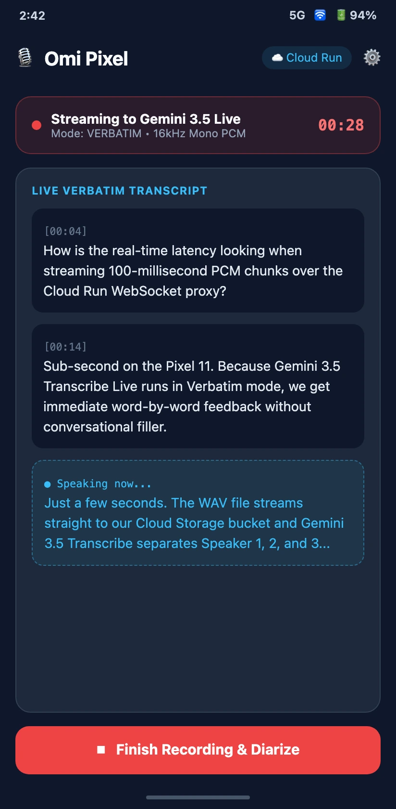
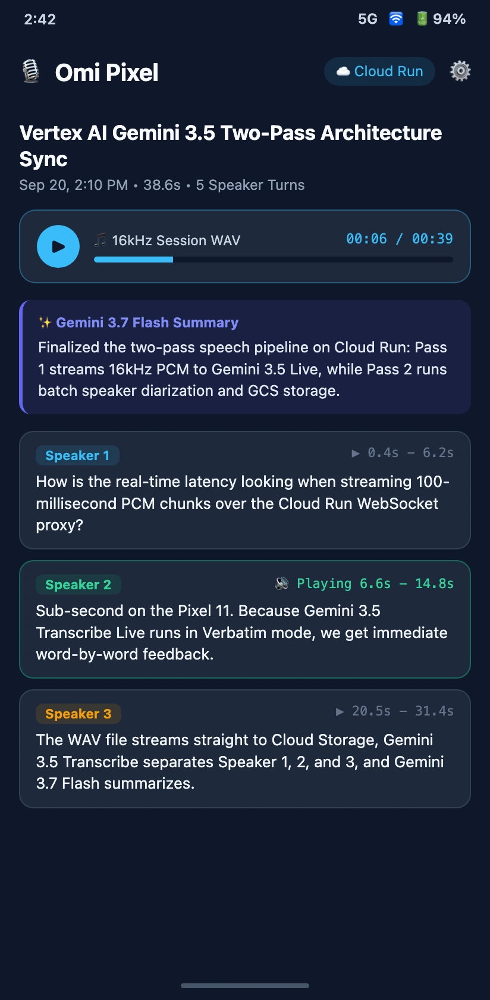
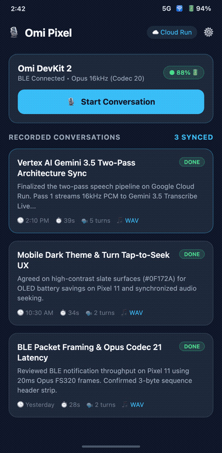
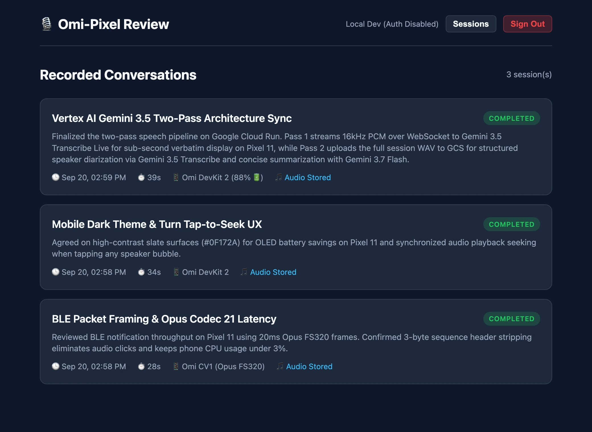
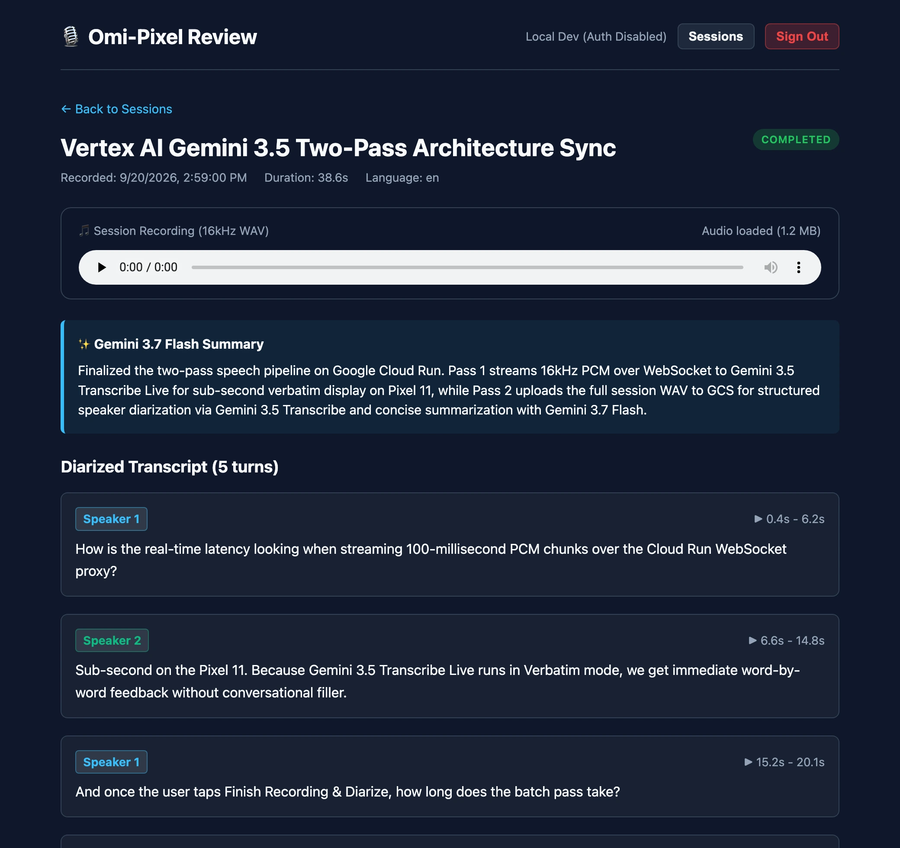

# 🎙️ Omi-Pixel

[](CHANGELOG.md)
[](#supported-hardware--audio-codecs)
[](#architecture)
[](#why-omi-pixel)
[](LICENSE)

A standalone, self-hosted **Flutter companion app for Google Pixel** and **Go Cloud Run backend** for **Omi wearable hardware (DevKit & CV1)**—combining sub-second live speech streaming via **Gemini 3.5 Transcribe Live** with post-session multi-speaker diarization (**Gemini 3.5 Transcribe**), AI synthesis (**Gemini 3.7 Flash**), and synchronized 16kHz WAV playback.

---

## ✨ Why Omi-Pixel?

- **🔒 100% Private, Self-Hosted Cloud**: Your raw audio and transcripts live exclusively in *your* Google Cloud project (Firestore + Cloud Storage) behind your personal Google account allowlist—zero third-party SaaS telemetry.
- **⚡ Two-Pass Gemini 3.5 Pipeline**:
  - **Pass 1 (Real-Time UX)**: Streams 16kHz mono PCM over WebSocket to `gemini-3.5-transcribe-live-preview` for instant verbatim or smart transcription while you speak.
  - **Pass 2 (Diarized Truth & Synthesis)**: Uploads the full 16kHz session WAV to Cloud Storage, separates speakers (`Speaker 1`, `Speaker 2`, …) with word-level timestamps via `gemini-3.5-transcribe-preview`, and synthesizes titles (`gemini-3.5-flash-lite`) and takeaways (`gemini-3.7-flash`).
- **🔋 Featherweight Pixel Companion**: Native `libopus` decoding (`Codec 20` & `Codec 21`), BLE auto-reconnect, and zero bloated cloud storage SDKs on the phone.
- **⏯️ Tap-to-Seek Audio Review (Mobile & Web)**: Tap any speaker turn card on your phone or in the responsive Web Review Dashboard to seek the 16kHz WAV player directly to that timestamp.

> [!TIP]
> **Scales to $0 When Idle**: The Go backend deploys to Google Cloud Run with `--min-instances=0`. When you aren't actively recording or reviewing sessions, compute scales to zero (`$0.00/mo`), and Firestore + Cloud Storage usage typically stays well within the Google Cloud Free Tier.

---

## 📱 Mobile Companion & Web Review Showcase

### Pixel Companion App (Dark OLED Material 3 UI)

| 1. Connect & Auto-Reconnect | 2. Live Verbatim Stream | 3. Diarized Turns & Tap-to-Seek |
| :---: | :---: | :---: |
|  |  |  |
| *BLE status, battery level, & synced history* | *Sub-second `gemini-3.5-transcribe-live-preview`* | *Speaker chips, Gemini 3.7 summary, & WAV seek* |

<p align="center">
  
</p>

### Built-In Web Review Dashboard (Hosted on Cloud Run)

Every deployment serves a responsive, dark-mode Web Review SPA protected by Firebase Google Sign-In and your Firestore `authorized_users` allowlist:

| Session History & Search | Synchronized WAV Player & Speaker Turns |
| :---: | :---: |
|  |  |

---

## 🎧 Supported Hardware & Audio Codecs

| Wearable Device | BLE Codec ID | Encoding | Frame Size | Sample Rate | Status |
|---|---|---|---|---|---|
| **Omi DevKit 1 / DevKit 2** | `20` (`0x14`) | Opus Standard | 10 ms (160 samples) | 16,000 Hz | ✅ Supported |
| **Omi CV1 / Consumer** | `21` (`0x15`) | Opus FS320 | 20 ms (320 samples) | 16,000 Hz | ✅ Supported |
| **Generic BLE Audio** | `0` / `1` | Linear PCM (16-bit / 8-bit) | Uncompressed | 16,000 / 8,000 Hz | ✅ Supported |

---

## 🏗️ Architecture


---

## 🚀 Quick Start (Makefile)

### 1. Configure Environment (`infra/.env`)

```bash
cp infra/.env.template infra/.env
# Edit infra/.env with your GOOGLE_CLOUD_PROJECT
```

### 2. Provision & Deploy Backend (or Run Locally)

```bash
# Provision GCP APIs, Service Account, Firestore DB, and GCS Bucket
make setup

# Generate Firebase client configuration (app/lib/firebase_options.dart & google-services.json)
make configure-firebase

# Authorize your Google account email in the Firestore allowlist
make authorize EMAIL=you@gmail.com ADMIN=true

# Deploy to Google Cloud Run (runs preflight -> deploy -> postflight)
make release
```

For **local development** over USB (with or without Firebase Auth):

```bash
# Start Go backend locally (or `make run-local-noauth` for zero-config offline mode)
make run-local

# In a second terminal, forward port 8080 from your Pixel to your Mac
make adb-reverse

# Launch the Flutter companion app on your connected Pixel
make run-app
```

---

## 🛠️ Usage Workflow

1. **Configure Service URL**: Open **Settings** (⚙️) in the app. Sign in with your authorized Google account, enter your Cloud Run URL (or `http://localhost:8080` via `make adb-reverse`), choose **Verbatim** or **Smart** live transcription mode, and tap **Test Connection**.
2. **Connect Wearable**: Turn on your Omi device and tap **Scan for Omi Device**. Once paired, Omi-Pixel remembers your wearable ID and automatically reconnects on future launches.
3. **Record & Stream**: Tap **Start Conversation**. Speech is decoded from BLE Opus packets to 16kHz PCM and streamed to Gemini 3.5 Transcribe Live for real-time display.
4. **Diarize & Review**: Tap **Finish Recording & Diarize**. The full session WAV is uploaded to Cloud Storage, diarized by speaker on Vertex AI, summarized by Gemini 3.7 Flash, and saved to Firestore.
5. **Listen & Seek**: Tap any speaker turn card on your phone or in the Web Review Dashboard to play the recording from that exact timestamp.

---

## 📚 Documentation

- **[User Guide](docs/user-guide.md)**: End-to-end GCP & Firebase setup, Pixel 11 installation options (USB, Sideload APK, Wireless ADB), and troubleshooting.
- **[Developer Guide](docs/developer-guide.md)**: Two-pass pipeline specification, BLE GATT characteristics, packet header framing, and REST/WebSocket API contracts.
- **[Changelog](CHANGELOG.md)**: Release history and version notes.

---

## 🧪 Development & Testing

```bash
# Run Go backend + Flutter unit tests
make test

# Run Go vet + Flutter static analysis
make analyze

# Build standalone release APK for sideloading
make build-apk
```

### Repository Layout

```text
omi-pixel/
├── app/                        # Flutter mobile companion (Android / Pixel)
│   ├── lib/                    # BLE auto-reconnect, libopus decoder, Live WS client, Material 3 UI
│   ├── android/                # Android manifest, BLE/foreground permissions
│   └── test/                   # Model serialization, WAV header, and widget tests
├── service/                    # Go Cloud Run backend service
│   ├── main.go                 # HTTP server & environment configuration
│   ├── live.go                 # Bidirectional Vertex AI Live WebSocket proxy (/api/live)
│   ├── gemini.go               # Gemini 3.5 Transcribe diarization & 3.7 Flash summary client
│   ├── auth.go                 # Firebase ID token verification & Firestore allowlist middleware
│   ├── store.go                # Firestore persistence adapter with in-memory fallback
│   ├── storage.go              # Google Cloud Storage WAV store with in-memory fallback
│   └── web/                    # Server-rendered Web Review SPA & synchronized audio player
├── infra/                      # Cloud automation (setup, preflight, deploy, postflight, authorize-user)
└── docs/                       # User/Developer guides, Graphviz diagrams, & screenshots
```

---

## 📄 License

This project is licensed under the MIT License. See the [LICENSE](LICENSE) file for details.
