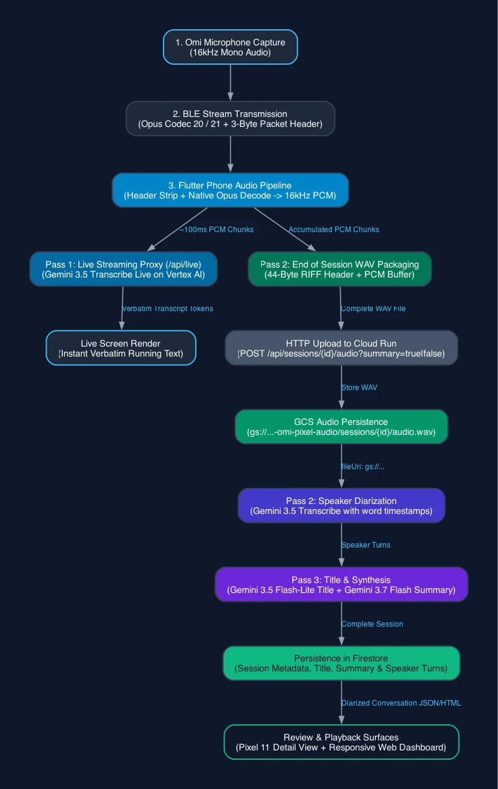

# Developer Guide: Omi-Pixel Architecture and Extension

This document covers the technical architecture, two-pass speech-to-text pipeline, BLE audio framing contracts, and API specifications for the Omi-Pixel companion app and Go backend service.

---

## 1. System Architecture

The Omi-Pixel system separates low-latency mobile device interaction from structured AI processing and cloud persistence.


The architecture contains three core tiers:

1. **Client Tier (Flutter on Android Pixel 11)**: Connects to Omi wearable hardware via Bluetooth Low Energy (GATT), strips transport packet framing, decodes compressed Opus audio into 16kHz linear PCM, streams audio to Cloud Run Live proxy, and accumulates session audio.
2. **AI Provider Tier (Google Cloud Vertex AI)**: 
   - **Pass 1 (Streaming)**: `gemini-3.5-transcribe-live-preview` via Vertex Live WebSocket proxy for instantaneous, verbatim visual feedback without conversational AI commentary.
   - **Pass 2 (Batch Diarization)**: `gemini-3.5-transcribe-preview` via Vertex REST with native `audioTranscriptionConfig{diarization: true, wordTimestamp: true}`.
   - **Pass 3 (Title & Summary)**: `gemini-3.5-flash-lite` for concise title generation and `gemini-3.7-flash` (thinkingLevel: LOW) for session summarization.
3. **Backend Tier (Go on Cloud Run)**: Relays live audio WebSocket to Vertex AI using server-side Application Default Credentials (ADC), orchestrates batch diarization & title/summary, persists sessions and speaker segments in Google Cloud Firestore (`omi-pixel`), and serves a server-rendered web review interface.

---

## 2. The Multi-Stage Pipeline



```
Pass 1 (Live UX):
Device Audio -> Opus Decode -> PCM 16kHz -> Cloud Run /api/live -> Vertex Live WS -> Verbatim Live Stream

Pass 2 (Diarized Truth):
Session Complete -> Pack 16kHz WAV -> Upload to Cloud Run -> Vertex 3.5 Transcribe -> Speaker Segments

Pass 3 (Metadata & Synthesis):
Transcript -> Gemini 3.5 Flash-Lite (Title) + Gemini 3.7 Flash (Summary) -> Structured Firestore Session
```

### Pass 1: Real-Time Stream
- The mobile app buffers ~100ms of 16-bit 16kHz mono audio.
- The client sends `{"audio": "<base64>"}` frames over WebSocket to the Cloud Run backend (`GET /api/live`).
- The Go proxy wraps the chunk into Vertex `realtimeInput` format with `Authorization: Bearer <token>` and listens for `inputTranscription` events, forwarding clean JSON `{type: "transcript", text: "...", isFinal: bool}` back to the phone.

### Pass 2 & 3: Structured Diarization, Title, and Summary
- When the user stops recording, the app packages the accumulated PCM stream into a standard 44-byte WAV.
- The app posts the WAV to `POST /api/sessions/{id}/audio?summary=true|false`.
- The Go backend:
  1. Calls `gemini-3.5-transcribe-preview` on Vertex AI (`global`) with `audioTranscriptionConfig{diarization: true, wordTimestamp: true}`.
  2. Parses candidate parts into speaker turns with accurate start and end timestamps.
  3. Prompts `gemini-3.5-flash-lite` to generate a concise 3–6 word title.
  4. If `summary=true`, prompts `gemini-3.7-flash` with `thinkingLevel: "LOW"` to generate a 2–4 sentence summary.
  5. Saves the session and segments to Firestore.

---

## 3. BLE Protocol and Audio Codecs

The mobile app relies on the `omi_device` Dart SDK (`sdks/device/dart`) and handles hardware audio framing directly.

### GATT Characteristics
- **Service UUID**: `19b10000-e8f2-537e-4f6c-d104768a1214`
- **Audio Stream Characteristic (Notify)**: `19b10001-e8f2-537e-4f6c-d104768a1214`
- **Codec Characteristic (Read)**: `19b10002-e8f2-537e-4f6c-d104768a1214`
- **Battery Level (Read/Notify)**: `00002a19-0000-1000-8000-00805f9b34fb`

### Codec Map
The first byte of the codec characteristic identifies the device audio encoding:

| Codec ID | Name | Hardware | Frame Duration | Sample Rate |
|---|---|---|---|---|
| `0` | PCM 16-bit | Generic | Uncompressed | 16,000 Hz |
| `1` | PCM 8-bit | Generic | Uncompressed | 8,000 Hz |
| `20` (`0x14`) | Opus Standard | Omi DevKit | 10 ms (160 samples) | 16,000 Hz |
| `21` (`0x15`) | Opus FS320 | Omi CV1 | 20 ms (320 samples) | 16,000 Hz |

### Audio Packet Stripping and Decoding
Every BLE notify packet on the audio characteristic begins with a 3-byte hardware sequence header:
```
[Byte 0: Seq LSB] [Byte 1: Seq MSB] [Byte 2: Flags] [Bytes 3..N: Compressed Audio]
```
The SDK function `stripPacketHeader(packet)` removes the first 3 bytes. The app passes the resulting payload to `AudioDecoder.instance.decodePayload()`, which uses native libopus bindings (`opus_dart` + `opus_flutter`) to emit 16-bit little-endian mono PCM samples at 16,000 Hz.

---

## 4. Module and File Map

### Mobile Companion (`app/`)
```
app/lib/
├── firebase_options.dart          # FlutterFire generated platform configurations
├── main.dart                      # Application bootstrap, theme configuration
├── models/
│   ├── device.dart                # OmiDeviceInfo and DeviceCodec definitions
│   ├── segment.dart               # Speaker turn segment model
│   └── session.dart               # Conversation session model with lifecycle states
├── services/
│   ├── api_client.dart            # Authenticated HTTP client for Go Cloud Run backend
│   ├── audio_decoder.dart         # Native libopus wrapper and 44-byte RIFF WAV encoder
│   ├── auth_service.dart          # Firebase Auth & Google Sign-In with auto ID token refresh
│   ├── ble_service.dart           # Device scan, connection lifecycle, and battery checks
│   ├── gemini_live_service.dart   # Authenticated WebSocket client for /api/live proxy
│   ├── session_manager.dart       # State coordinator, PCM buffer, and foreground task
│   └── settings_service.dart      # Persistent configuration using SharedPreferences
└── ui/
    ├── home_screen.dart           # Device connection banner, session list, recording trigger
    ├── live_screen.dart           # Fullscreen live transcript viewer with auto-scroll
    ├── login_screen.dart          # Google Sign-In user gate
    ├── session_detail_screen.dart # Diarized conversation review with speaker color chips
    └── settings_screen.dart       # Account card, Cloud Run URL, and language configuration
```

### Go Backend (`service/`)
```
service/
├── auth.go                        # Firebase Admin SDK token verification & allowlist check
├── Dockerfile                     # Multi-stage Alpine container build (Go 1.25)
├── gemini.go                      # Vertex AI Gemini 3.5 Transcribe, Flash-Lite & 3.7 Flash client
├── go.mod / go.sum                # Go dependencies (firestore, storage, firebase, oauth2)
├── handlers.go                    # API routes, CORS middleware, audio upload & WebSocket proxy
├── handlers_test.go               # Server unit tests for routing, storage, and web UI
├── live.go                        # Bidirectional WebSocket live transcription proxy
├── main.go                        # HTTP server configuration and graceful signal shutdown
├── storage.go                     # Google Cloud Storage audio store adapter
├── store.go                       # Storage interface, Firestore adapter, and memory store
├── vertex.go                      # Vertex AI ADC token management and endpoint URL builders
└── web/
    └── templates.go               # Server-rendered HTML review dashboard
```

### Infrastructure Automation (`infra/`)
```
infra/
├── .env.template                  # Environment configuration template
├── authorize-user.sh              # Adds/removes users from Firestore authorized_users allowlist
├── deploy.sh                      # Cloud Run deployment script (with dedicated SA and timeout)
├── postflight.sh                  # Post-deployment, database binding, and GCS verification
├── preflight.sh                   # Environment validation gate before deployment
└── setup.sh                       # GCP project setup, SA creation, IAM binding, and DB provisioning
```

---

## 5. Backend REST & WebSocket API Specification

### Health Check
- **Endpoint**: `GET /api/health`
- **Auth**: Public
- **Response**: `200 OK`
  ```json
  { "service": "omi-pixel", "status": "ok" }
  ```

### Live Transcription WebSocket
- **Endpoint**: `GET /api/live?lang=en-US&session=sess_123&access_token=<FIREBASE_ID_TOKEN>`
- **Auth**: Required (Firebase ID Token via query param or Bearer header)
- **Protocol**: Bidirectional WebSocket. Client sends `{"audio":"<b64>"}` frames; server streams `{"type":"transcript","text":"...","isFinal":bool,"timestamp":float}` events.

### Create Session Metadata
- **Endpoint**: `POST /api/sessions`
- **Auth**: Required (`Authorization: Bearer <ID_TOKEN>`)
- **Headers**: `Content-Type: application/json`
- **Request Body**:
  ```json
  {
    "id": "sess_12345678",
    "device_id": "omi_devkit_01",
    "title": "Team Sync",
    "language": "en",
    "started_at": "2026-08-29T10:00:00Z"
  }
  ```
- **Response**: `201 Created` with the initialized `Session` object.

### Upload Session Audio and Run Diarization
- **Endpoint**: `POST /api/sessions/{id}/audio?summary=true|false`
- **Auth**: Required (`Authorization: Bearer <ID_TOKEN>`)
- **Headers**: `Content-Type: multipart/form-data` or `Content-Type: audio/wav`
- **Form Field**: `audio` (WAV binary)
- **Processing**:
  1. Persists WAV audio to GCS bucket `gs://...-omi-pixel-audio/sessions/{id}/audio.wav`.
  2. Submits audio to Gemini 3.5 Transcribe on Vertex AI (`global`) with `audioTranscriptionConfig{diarization: true, wordTimestamp: true}`.
  3. Generates concise title via `gemini-3.5-flash-lite`.
  4. If `summary=true`, generates conversation summary via `gemini-3.7-flash` (`thinkingLevel: LOW`).
  5. Writes session metadata, title, summary, and speaker turns to Firestore named database `omi-pixel`.
- **Response**: `200 OK` with `SessionDetail` (Session metadata + `segments` array).

### List Sessions
- **Endpoint**: `GET /api/sessions`
- **Response**: `200 OK` with JSON array of the 50 most recent sessions.

### Get Session Detail
- **Endpoint**: `GET /api/sessions/{id}`
- **Response**: `200 OK` with full `SessionDetail` JSON.

### Direct Segments Insertion (Fallback Sync)
- **Endpoint**: `POST /api/sessions/{id}/segments`
- **Headers**: `Content-Type: application/json`
- **Request Body**:
  ```json
  {
    "title": "Offline Conversation",
    "summary": "Imported transcript",
    "segments": [
      {
        "speaker": "Speaker 1",
        "speaker_id": 0,
        "text": "Hello world",
        "start": 0.0,
        "end": 2.5
      }
    ]
  }
  ```
- **Response**: `200 OK`

---

## 6. Build and Verification Suite

Run verification commands from the project root.

### Test the Go Backend
```bash
cd service
go test -v ./...
go build -o /dev/null .
```

### Analyze and Test the Flutter App
```bash
cd app
flutter analyze
flutter test
```

---

## 7. Extension Points

1. **Authentication**: The default Cloud Run deployment allows unauthenticated access for simplicity. To restrict access, configure Cloud Run IAM or add an API key validation middleware in `service/handlers.go`.
2. **Audio Storage in GCS**: To retain raw WAV recordings alongside transcripts, inject `cloud.google.com/go/storage` into `handleUploadAudio` in `service/handlers.go`.
3. **Custom Speaker Naming**: The UI uses default labels (`Speaker 1`, `Speaker 2`). You can extend `SessionDetailScreen` to let users rename speaker identifiers and persist aliases back to the server.
